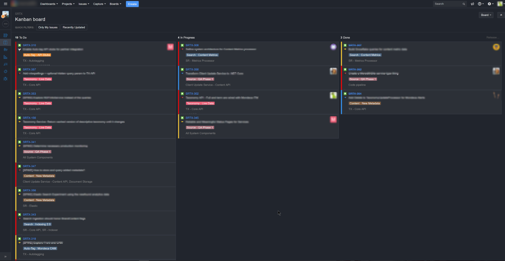

# Jira Carbon

Dark theme for Jira by Atlassian

## Preview

## How to use

Install a userstyle manager for your favorite browser:

- [Google Chrome](https://chrome.google.com/webstore/detail/stylus/clngdbkpkpeebahjckkjfobafhncgmne?hl=en)
- [Firefox](https://addons.mozilla.org/en-US/firefox/addon/styl-us/) (be sure to place the CSS inside the `@-moz-document domain("github.com")` block, but is best to install as a userstyle)
- [Safari](http://sobolev.us/stylish)

### Userstyles.org

If you use the Stylish addon on Chrome or Firefox you can find one-click installs including automatic updates via the packages below.

[Jira Carbon](https://userstyles.org/styles/154743/jira-carbon)

### Bug reports

Open an issue or submit a pull request, please.
